Below are pictures for the process of installing Ubuntu Linux server

Boot to DVD
 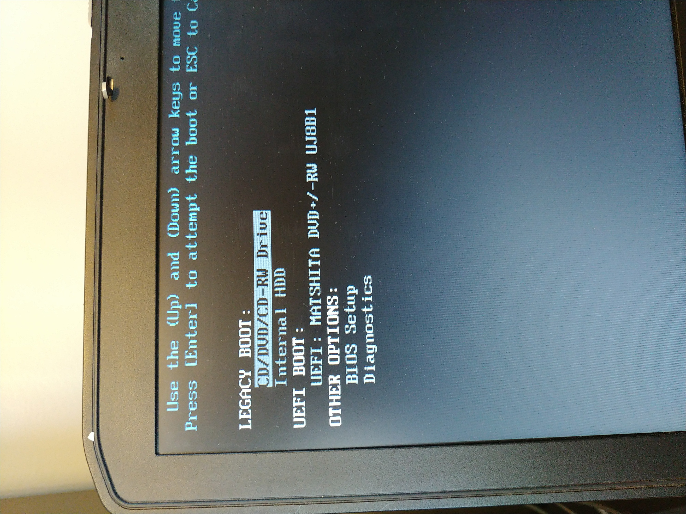

Choose Ubuntu Server
 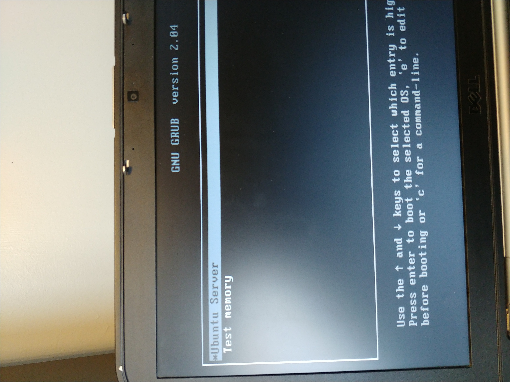

Language
 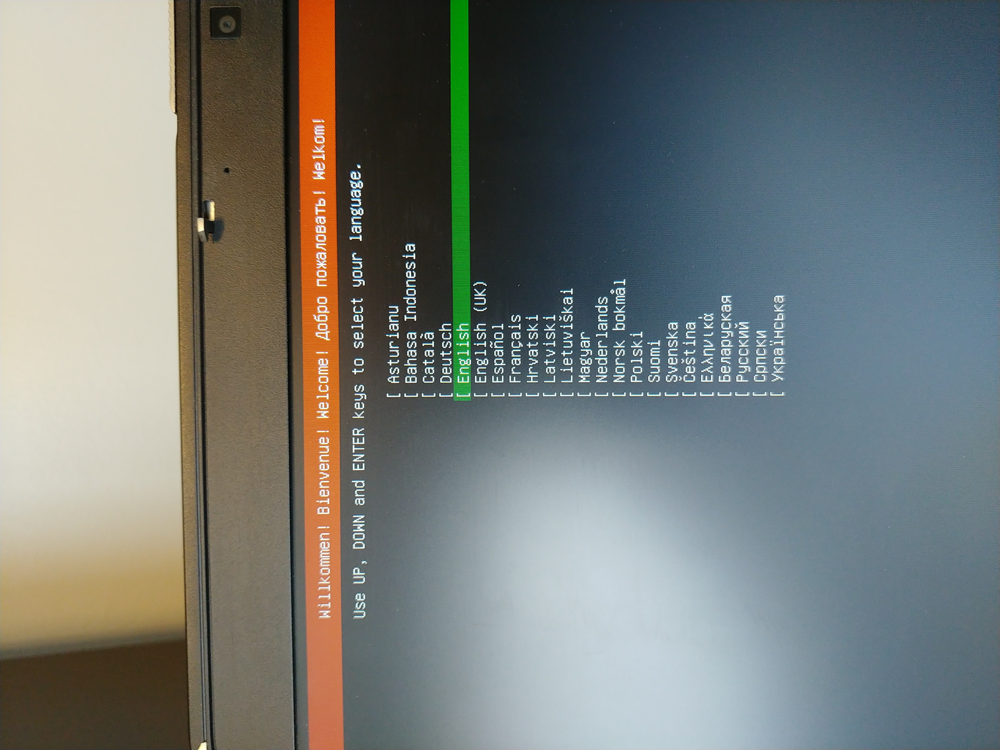

Keyboard
 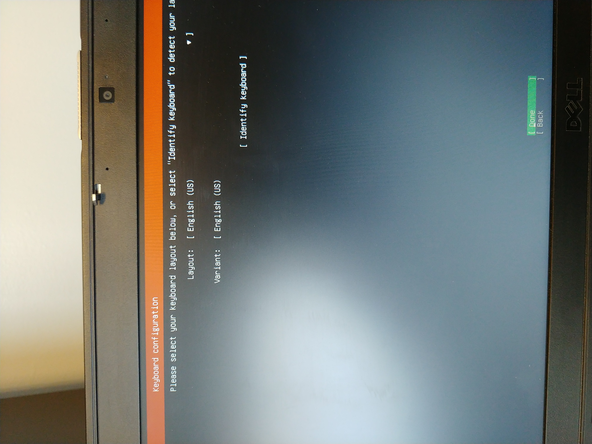

Network
 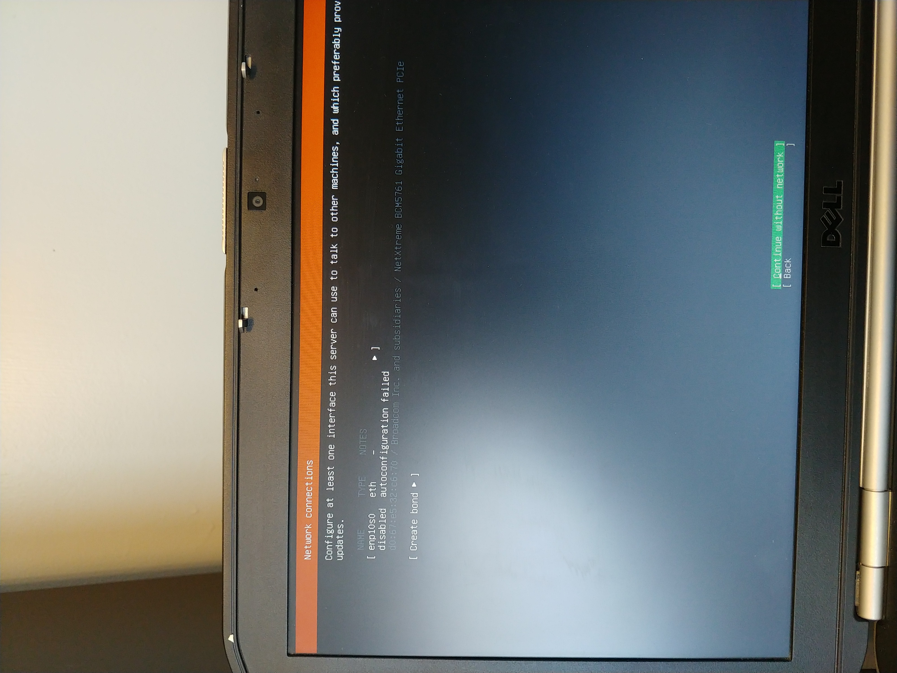

Configure Network
 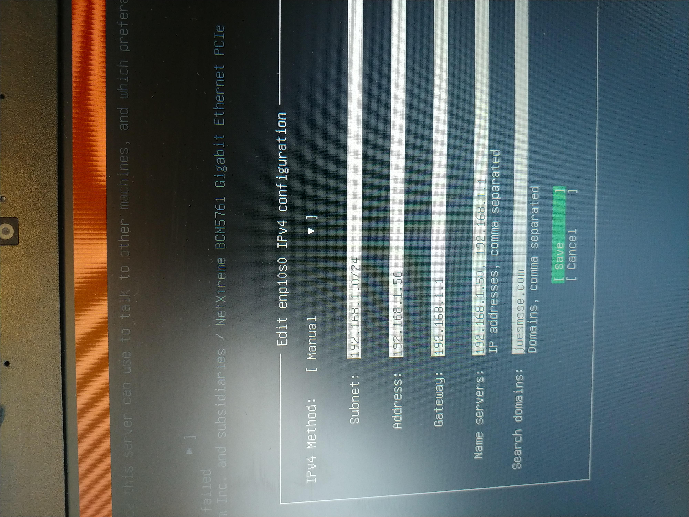

Language
 

Storage 1
 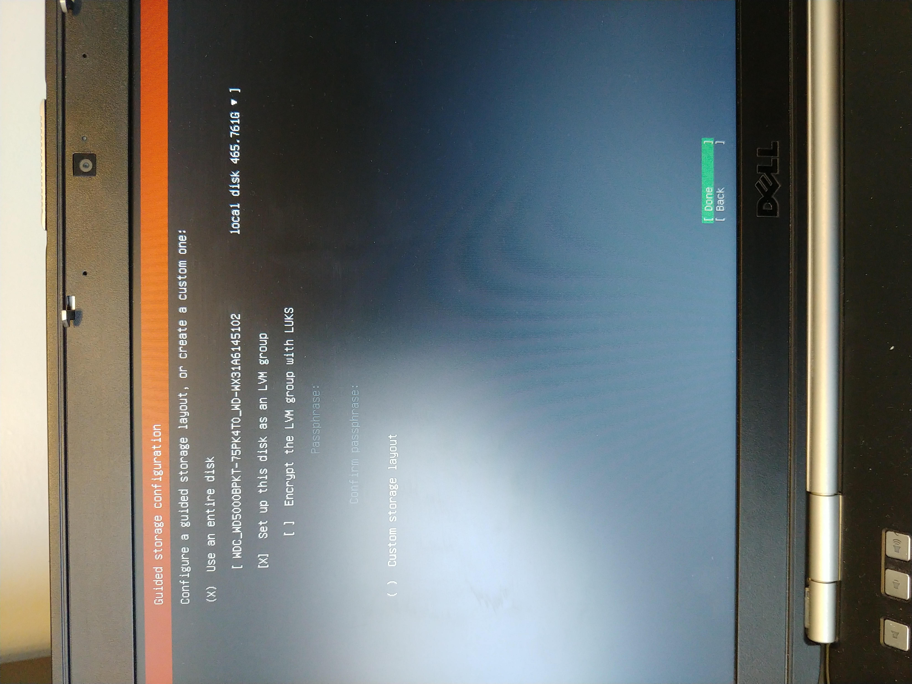

Storage 2
 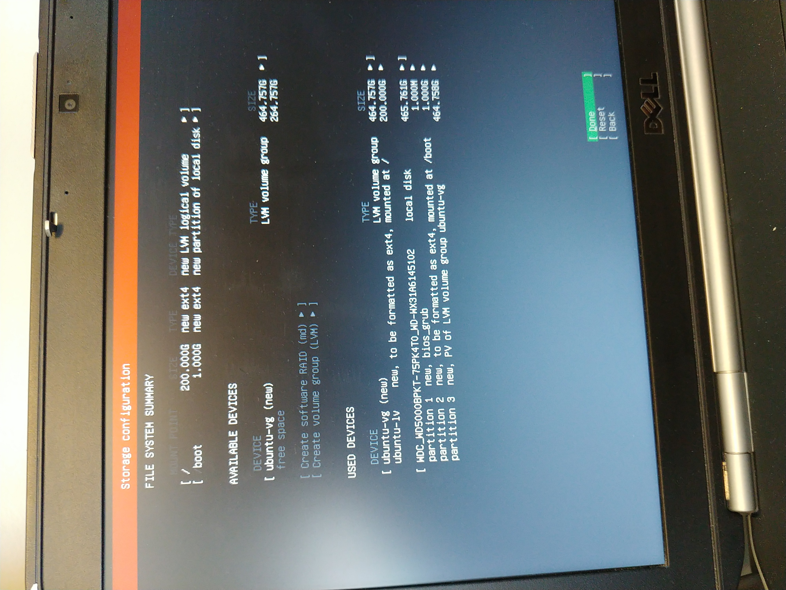

Confirm
 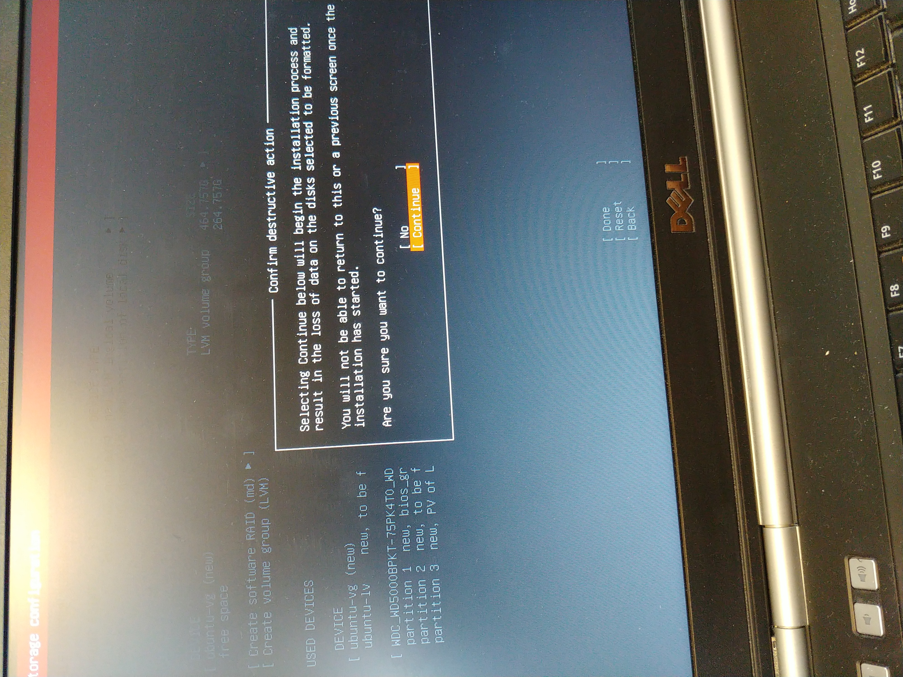

Name the box and create a user
 

ssh
 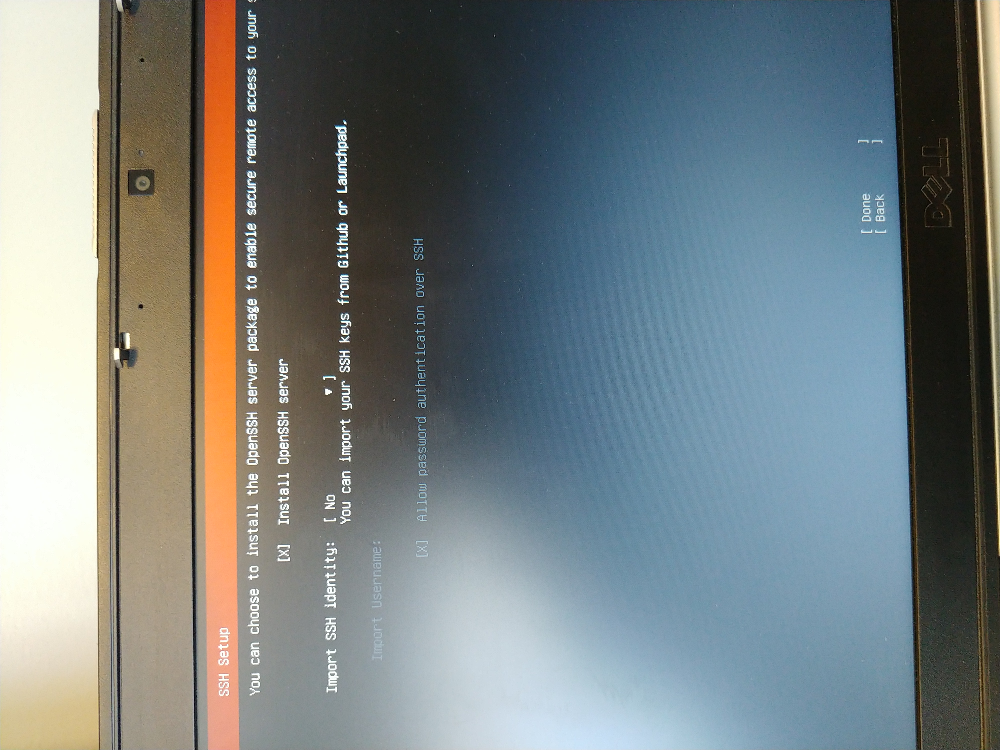

Don't Install Other Packages
 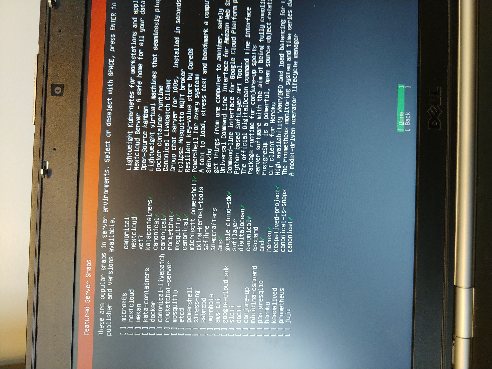

Let Updates Run and Finish
 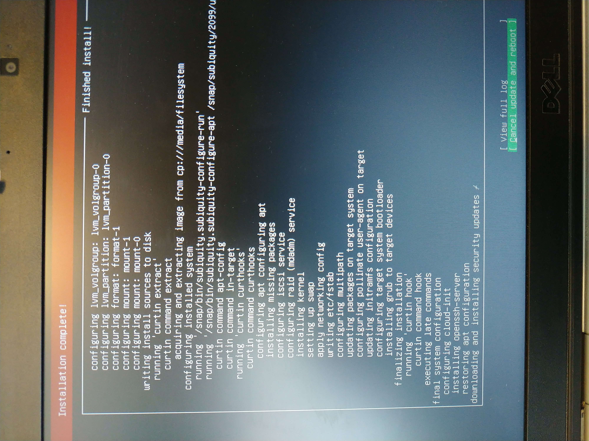

Six "servers" sitting on my desk
 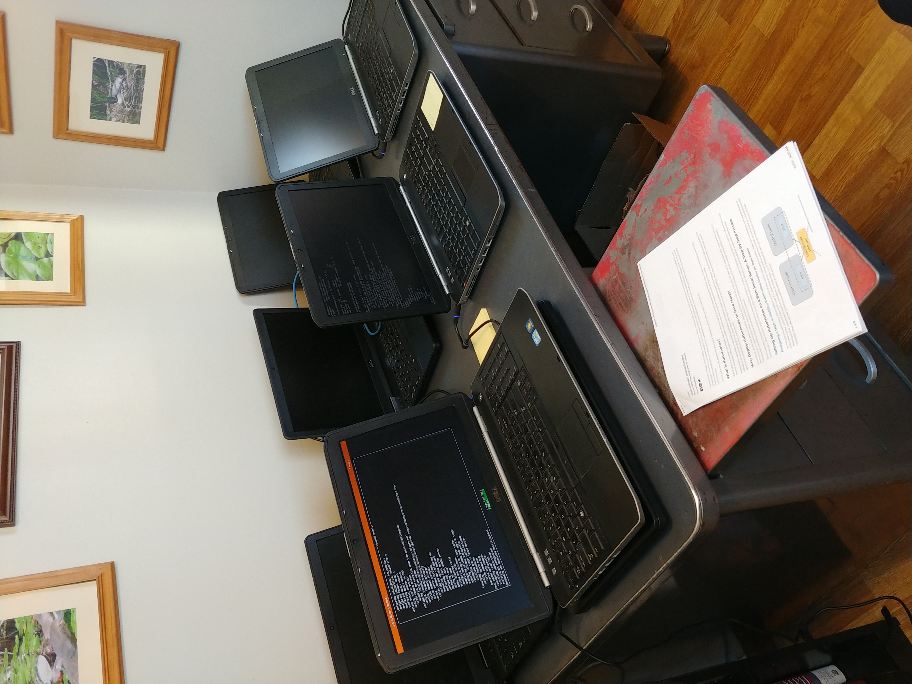

