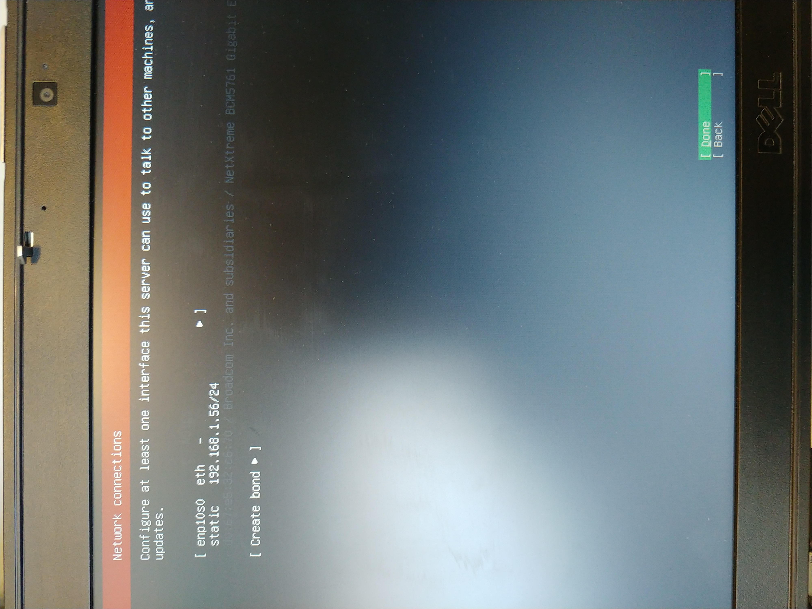
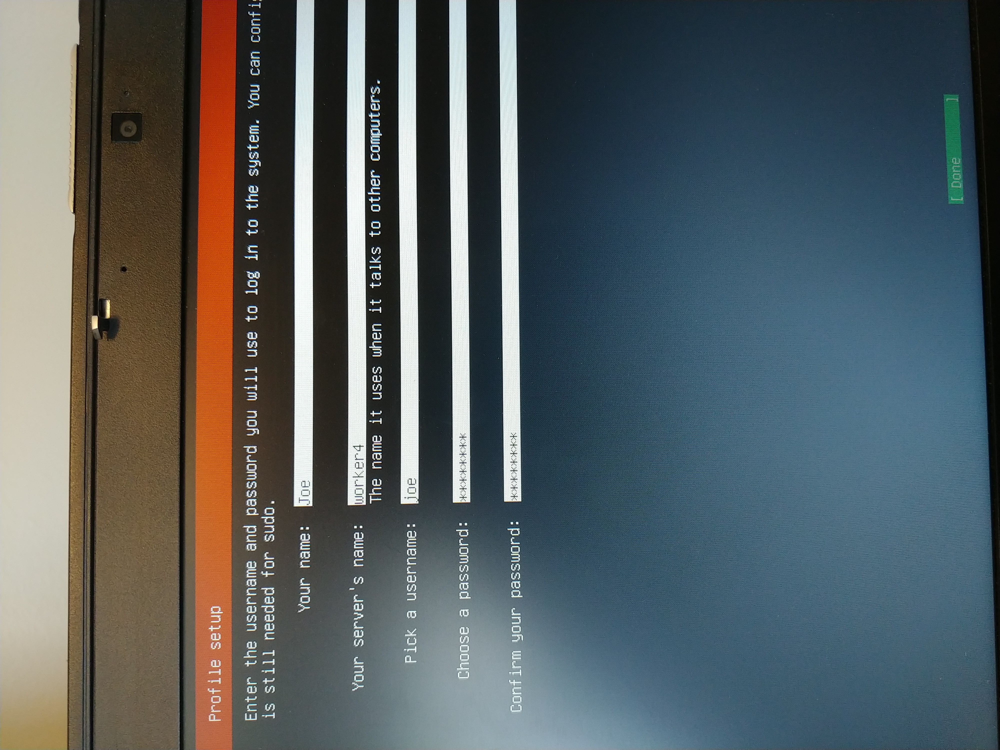

Below are pictures for the process of installing Ubuntu Linux server

Boot to DVD
{:height="200px"}

Choose Ubuntu Server

Language

Keyboard

Network

Configure Network

Language

Storage 1

Storage 2

Confirm

Name the box and create a user

ssh

Don't Install Other Packages

Let Updates Run and Finish

Six "servers" sitting on my desk

